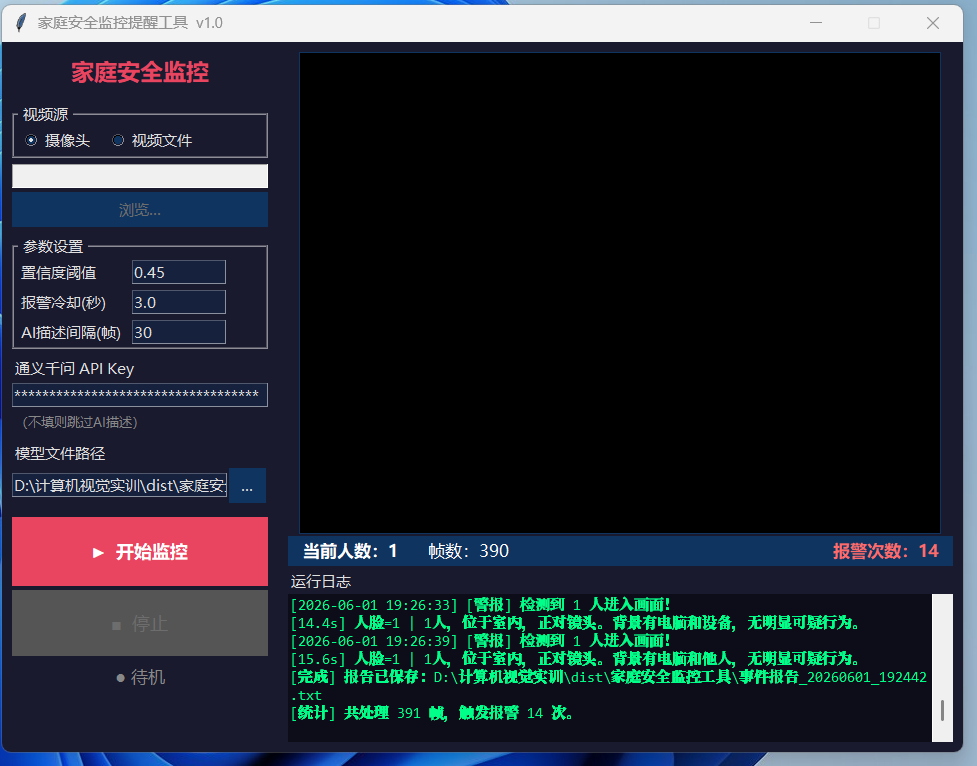

<div align="center">
  <br>
  
  <br><br>
  <h1>🏠 家庭安全监控检测系统</h1>
  <p><strong>YOLOv8 人脸检测</strong> · <strong>通义千问视觉大模型</strong> · <strong>实时报警</strong> · <strong>自动录像</strong></p>
  <p>
    Python 3.8+ &nbsp;|&nbsp; YOLOv8-face &nbsp;|&nbsp; Qwen-VL &nbsp;|&nbsp; OpenCV &nbsp;|&nbsp; MIT License
  </p>
  <p>
    <a href="#-快速开始">🚀 快速开始</a> ·
    <a href="#-核心功能">✨ 功能</a> ·
    <a href="#️-配置参数">⚙️ 配置</a> ·
    <a href="#-项目结构">📁 结构</a> ·
    <a href="#-技术栈">🛠️ 技术栈</a>
  </p>
  <br>
</div>

---

<div align="center">
  <h3>⭐ 如果这个项目对你有帮助，请点个 Star 支持一下！</h3>
  <p>
    <a href="https://github.com/LKFAN-Ops/home-security-monitor/stargazers">🌟 Star</a>
    &nbsp;|&nbsp;
    <a href="https://github.com/LKFAN-Ops/home-security-monitor/forks">🍴 Fork</a>
    &nbsp;|&nbsp;
    <a href="https://github.com/LKFAN-Ops/home-security-monitor/issues">🐛 Issues</a>
  </p>
</div>

<br>

> 🔥 **一个开箱即用的智能家庭安防方案** —— 摄像头实时守护，人脸检测 + AI 场景理解，全自动录像与报警。

<br>

## ✨ 核心功能

| 功能 | 说明 |
|------|------|
| 👤 **实时人脸检测** | YOLOv8n-face 专用模型，毫秒级识别画面中的人脸 |
| 🚨 **入侵声光报警** | 检测到入侵者 → 画面红色警告栏 + 控制台日志 |
| 🤖 **AI 场景描述** | 通义千问 VL 大模型智能分析画面，描述人数、位置、行为 |
| ⏱️ **智能冷却机制** | 可配置冷却时间，避免重复报警刷屏 |
| 📹 **自动保存录像** | 全程录制带检测框的监控视频（MP4） |
| 📄 **事件报告生成** | 自动输出 TXT 格式安全日志，可追溯每一条报警 |
| 🖥️ **图形化界面** | Tkinter 可视化面板，参数实时可调，开箱即用 |
| 📦 **独立打包 exe** | PyInstaller 一键打包，脱离 Python 环境运行 |

<br>

## 🗂️ 项目结构

```
📁 计算机视觉实训/
│
├── 🏠 家庭安全监控系统（核心项目）
│   ├── safe.py                   # CLI 命令行版监控主程序
│   ├── safe_gui.py               # GUI 图形界面版
│   └── 家庭安全监控工具.spec     # PyInstaller 打包配置文件
│
├── 📚 辅助学习模块（计算机视觉实训）
│   ├── module1_edge_detection.py         # 边缘检测与轮廓绘制
│   ├── module2_edge_detection.py         # 通义千问车辆检测
│   ├── module3_car_flow_counter.py       # 帧差法车流量统计
│   ├── module4_tongyi_car_detection.py   # 大模型车流量计数
│   ├── yolo.py                           # YOLOv8 车辆追踪计数
│   ├── fruit.py                          # 水果忍者体感游戏
│   └── test_api.py                       # 通义千问 API 连通性测试
│
├── 📸 screenshots/              # 效果截图
├── build.bat                    # 一键打包脚本
└── 📖 README.md                 # 项目文档
```

> 💡 **家庭安全监控系统**是本项目的核心，其余模块为实训过程中配套的计算机视觉学习案例。

<br>

## 🚀 快速开始

### 环境要求

- **Python 3.8+**
- **摄像头**（或本地视频文件）

### 安装依赖

```bash
pip install ultralytics opencv-python openai requests pillow
```

### 配置 API Key

所有模块统一通过环境变量 `DASHSCOPE_API_KEY` 读取，**代码中不留任何密钥**，安全无忧。

```powershell
# 推荐：设置为用户环境变量（持久化）
[System.Environment]::SetEnvironmentVariable("DASHSCOPE_API_KEY", "sk-你的API密钥", "User")

# 或临时设置（仅当前会话）
$env:DASHSCOPE_API_KEY = "sk-你的API密钥"
```

🔗 前往 [阿里云 DashScope](https://dashscope.aliyun.com/) 注册并免费获取 API Key。

### 运行系统

```bash
# 命令行版
python safe.py

# 图形界面版（推荐）
python safe_gui.py
```

<br>

## ⚙️ 配置参数

在 `safe.py` 中快速调整以下参数：

| 参数 | 说明 | 默认值 |
|------|------|--------|
| `INPUT_SOURCE` | `0`=摄像头 / 视频文件路径 | `0` |
| `CONF_THRESH` | 人脸检测置信度阈值 | `0.45` |
| `ALERT_COOLDOWN` | 报警冷却间隔（秒） | `3.0` |
| `AI_INTERVAL` | AI 场景描述间隔（帧数） | `30` |
| `OUTPUT_VIDEO` | 输出录像文件名 | `监控录像_带检测框.mp4` |
| `OUTPUT_REPORT` | 输出事件报告文件名 | `安全监控事件报告.txt` |

<br>

## 📦 打包为独立 exe

无需安装 Python，双击即可运行！

```bash
# 方式一：一键打包
build.bat

# 方式二：手动打包
pip install pyinstaller
pyinstaller 家庭安全监控工具.spec
```

📁 打包产物位于 `dist/家庭安全监控工具/` 目录。

<br>

## 🧩 辅助模块速览

| 模块 | 核心技术 | 功能亮点 |
|------|----------|----------|
| `module1` | Canny / Sobel 边缘检测 | 车辆轮廓提取与绘制 |
| `module2` | 通义千问 VL+ 大模型 | 运动车辆智能检测 |
| `module3` | 帧差法 | 基于运动检测的车流量统计 |
| `module4` | 通义千问 VL+ 大模型 | 大模型车流量计数与标注 |
| `yolo.py` | YOLOv8 + DeepSORT | 车辆追踪与唯一 ID 计数 |
| `fruit.py` | OpenCV + 手势识别 | 🎮 水果忍者体感交互游戏 |

<br>

## 🛠️ 技术栈

| 技术 | 用途 |
|------|------|
| [YOLOv8](https://github.com/ultralytics/ultralytics) | 人脸检测模型 |
| [通义千问 VL](https://dashscope.aliyun.com/) | 视觉大模型场景描述 |
| [OpenCV](https://opencv.org/) | 图像处理与视频流 |
| [Tkinter](https://docs.python.org/3/library/tkinter.html) | GUI 图形界面框架 |
| [Pillow](https://python-pillow.org/) | 图像处理与界面渲染 |
| [PyInstaller](https://pyinstaller.org/) | 应用打包为 exe |

<br>

---

<div align="center">
  <h3>⭐ 如果这个项目对你有帮助，请点个 Star 支持一下！</h3>
  <p>你的支持是我持续改进的动力 🚀</p>
  <br>
  <sub>Built with ❤️ using Python & OpenCV</sub>
  <br>
  <sub>MIT © 2026 LKFAN-Ops</sub>
</div>
